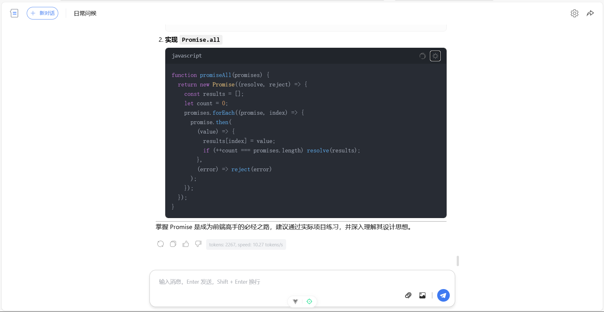
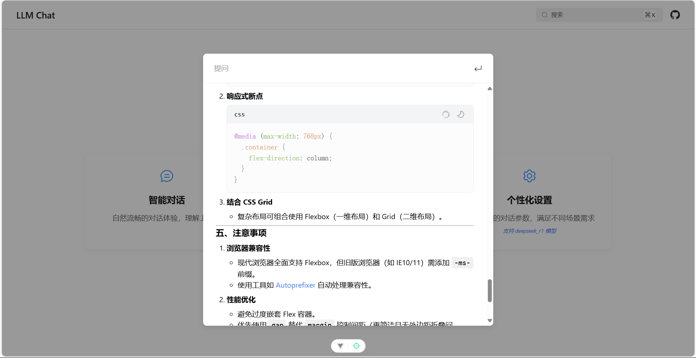

# Felix Chat - 智能AI对话助手

🚀 一个功能强大的现代化AI聊天应用，基于Vue 3构建，专注于提供极致的用户体验和完整的深色主题支持。

## ✨ 项目亮点

- 🎨 **完美深色主题** - 全组件深色模式适配，护眼舒适
- 💬 **智能对话体验** - 支持多种AI模型，流式响应更自然  
- 🎯 **现代化设计** - 简洁优雅的界面，响应式布局
- ⚡ **高性能架构** - Vue 3 + Vite，极速开发体验

## 🌟 特性

- 💬 多会话管理
- 📝 Markdown 支持
- 🖥️ 代码高亮显示
- 📤 文件和图片上传
- 🌊 流式响应
- 🎨 深色/浅色主题
- 💾 本地数据持久化
- 📱 响应式设计

## 🛠️ 技术栈

- **前端框架**: Vue 3 + Vite
- **状态管理**: Pinia
- **UI 组件**: Element Plus
- **样式处理**: SCSS
- **Markdown 渲染**: Marked.js
- **代码高亮**: Highlight.js
- **动画效果**: Animate.css
- **持久化存储**: Pinia-plugin-persistedstate

## 📸 项目演示

### 首页展示


_首页包含项目介绍和主要功能入口，简洁直观的设计风格。_

### 独立对话界面


_支持多会话管理、消息历史、代码高亮等功能，提供流畅的对话体验。_

### 内联搜索对话


_快捷的内联搜索对话框，支持快速检索和问答，提升使用效率。_

## 📦 项目结构

```bash
src/
├── assets/ # 静态资源
├── components/ # 组件
│ ├── ChatInput.vue # 聊天输入框组件
│ ├── ChatMessage.vue # 消息显示组件
│ ├── DialogEdit.vue # 对话编辑弹窗
│ ├── PopupMenu.vue # 侧边菜单组件
│ ├── SearchDialog.vue # 搜索对话框组件
│ └── SettingsPanel.vue # 设置面板组件
├── stores/ # Pinia 状态管理
│ ├── chat.js # 聊天相关状态
│ └── setting.js # 设置相关状态
├── utils/ # 工具函数
│ ├── api.js # API 请求封装
│ ├── markdown.js # Markdown 处理
│ └── messageHandler.js # 消息处理
├── views/ # 页面
│ ├── HomePage.vue # 首页
│ └── ChatView.vue # 主聊天页面
└── App.vue # 根组件
```

## 🚀 核心功能

### 🎨 主题系统
- **完整深色主题支持** - 所有组件完美适配深色模式
- **智能主题切换** - 一键切换，设置自动保存
- **护眼设计** - 精心调校的色彩搭配，长时间使用更舒适

### 💬 智能对话
- **多模型支持** - DeepSeek-V3、GPT系列等主流AI模型
- **流式响应** - 实时显示AI回复，体验更自然
- **会话管理** - 多会话并行，历史记录永久保存
- **富文本支持** - Markdown渲染、代码高亮、文件预览

### ⚙️ 个性化设置
- **模型参数调节** - Temperature、Top-P、Max Tokens等
- **界面自定义** - 字体大小、布局调整
- **数据持久化** - 本地存储，设置永不丢失

## 🔧 配置项

### 模型设置

- 支持多种 LLM 模型
- 可配置 API 密钥
- 自定义模型参数

### 界面设置

- 主题切换
- 字体大小调整
- 界面布局设置

## 💾 数据持久化

使用 Pinia 持久化插件实现：

- 会话历史记录
- 用户设置
- 主题偏好

## 🚀 快速开始

### 环境要求
- Node.js 16+ 
- pnpm 或 npm

### 安装运行

```bash
# 克隆项目
git clone https://github.com/felix/felix-chat.git
cd felix-chat

# 安装依赖
pnpm install

# 启动开发服务器
pnpm dev
```

### 配置使用

1. **设置API Key** - 点击设置按钮，输入您的AI模型API密钥
2. **选择模型** - 支持DeepSeek-V3、glm-4、Qwen-2.5等多种模型
3. **开始对话** - 创建新会话或从历史记录继续
4. **个性化设置** - 调整主题、参数等个人偏好

## 🎯 技术特色

- **Vue 3 Composition API** - 现代化的响应式架构
- **Pinia 状态管理** - 轻量级、类型安全的状态管理
- **Element Plus UI** - 企业级组件库，深度定制主题
- **SCSS 模块化样式** - 可维护的样式架构
- **Vite 构建工具** - 极速的开发体验

## 📧 联系作者

- **作者**: Felix
- **邮箱**: huanzhang1832601@gmail.com
- **GitHub**: [felix](https://github.com/felix)

## 📄 开源协议

本项目基于 MIT 协议开源，欢迎自由使用和贡献代码。
